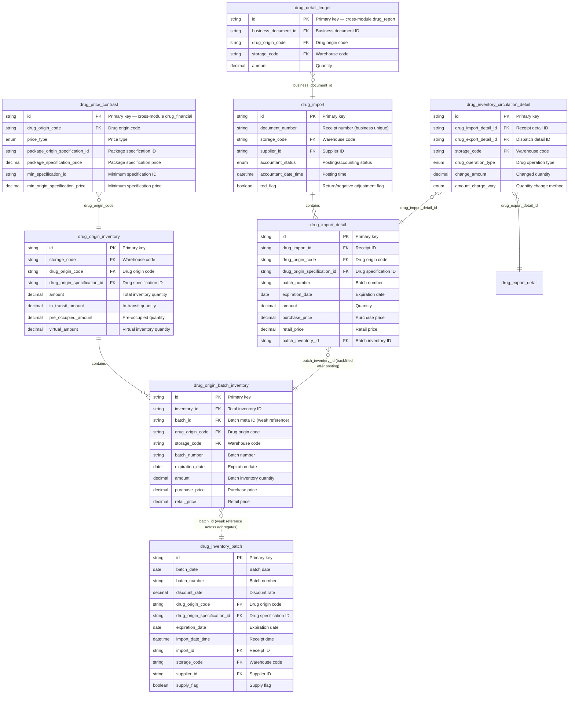
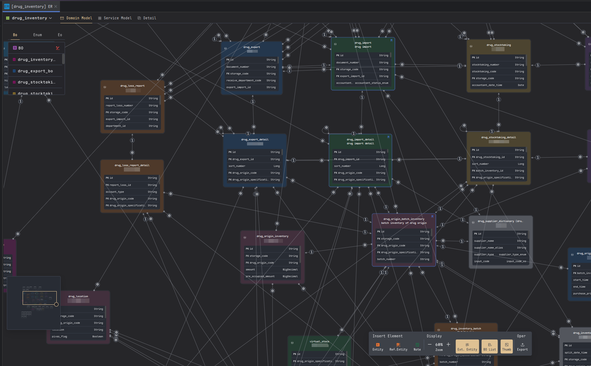
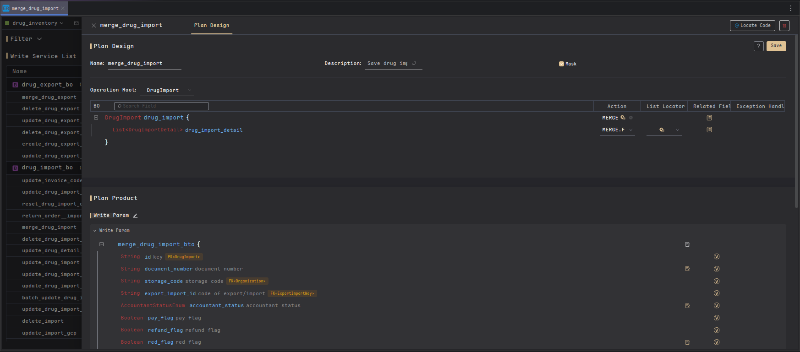
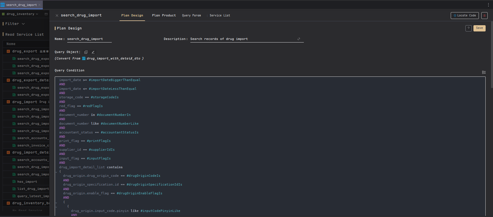
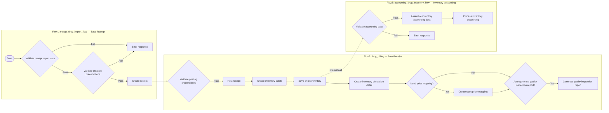
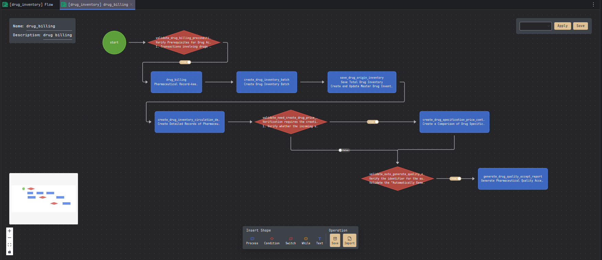
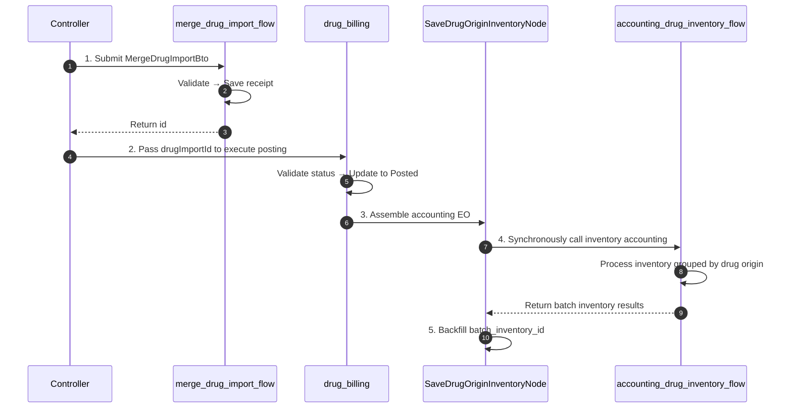

<div align="center">

<a id="top"></a>

# TocoAI Case Study: Domain Engineering in HIS Drug Inventory Management

<h3>Harness Engineering in Action — A Large-Scale Hospital Information System</h3>

[![Project Scale][scale-shield]][scale-detail]
[![Efficiency Gain][efficiency-shield]][efficiency-detail]
[![AI Adoption][adoption-shield]][adoption-detail]
[![Tech Stack][stack-shield]][stack-detail]

<br/>

[← Back to Main README][main-readme] · [DSL Reference][dsl-ref] · [BnB Demo →][bnb-demo]

**English** · [简体中文](TocoAI-HIS-DrugInventory-Case-Study.zh-CN.md) · [日本語](TocoAI-HIS-DrugInventory-Case-Study.ja-JP.md)

</div>

---

> [!TIP]
> This document is the detailed expansion of the **"Real-World Case: Large-Scale Hospital HIS"** section from the [TocoAI main README](../README.md). If you have just finished reading the main doc and are curious how DSL-Spec, the modeling engine, and FuncFlow look in real-world business scenarios, this case study is for you.

> [!NOTE]
> This case study focuses on **architecture design and code delivery**, not installation or configuration tutorials. We recommend going through the [BnB demo project](https://tocoai.dev/docs/your-first-toco-project) first to understand basic concepts like DTO, WritePlan, and ReadPlan for a smoother reading experience.

<details>
<summary><kbd>Table of Contents</kbd></summary>

- [Case Overview](#overview)
- [Scenario & Pain Points](#scenario)
  - [Requirements](#requirements)
  - [Core Challenges](#challenges)
- [The TocoAI Solution](#solution)
  - [Domain Model](#domain-model)
  - [Write Plan & Read Plan](#read-write-plan)
  - [Flow Orchestration](#flow-orchestration)
- [Core Code](#core-code)
  - [File Structure](#file-structure)
  - [BTO (Auto-Generated)](#bto-auto-generated)
  - [Controller (Developer Extension)](#controller)
  - [Flow Nodes (AI-Assisted)](#flow-nodes)
- [Results](#results)
  - [Comparison with Traditional HIS](#traditional-his)
  - [Comparison with General-Purpose AI Tools](#ai-tools-comparison)
- [Further Reading](#further-reading)

</details>

---

> [!TIP]
> **TL;DR**: This case study demonstrates how TocoAI delivered the drug inventory module within a 120+ module hospital HIS system using DSL-Spec and the modeling engine. For the core API `POST /api/drug-inventory/merge-drug-import-billing`, roughly **80% of the structural code was deterministically generated by the engine**, while the remaining **20% of business logic was AI-assisted and developer-reviewed**, resulting in an AI code adoption rate of nearly **97%**.

<a id="overview"></a>

## Case Overview

| Dimension | Details |
|:---|:---|
| **Project** | A next-generation HIS (Hospital Information System) for a large medical institution |
| **Module** | Drug Inventory Management — the core hub of the pharmaceutical supply chain |
| **Scale** | 120+ core modules · 200+ business flows · 800+ functional pages |
| **Core API** | `POST /api/drug-inventory/merge-drug-import-billing` (Save receipt and post) |
| **Paradigm** | DSL-Spec defines architecture → Modeling engine generates 80% structural code → AI + developers complete 20% business logic |

> [!NOTE]
> **About the code**: This case study is based on a real commercial project. The DSL-Spec, ER diagrams, and code snippets shown here have been simplified for educational purposes; sensitive fields and complete source code are not publicly disclosed.

---

<a id="scenario"></a>

## Scenario & Pain Points

The drug inventory warehouse is the core hub of the pharmaceutical supply chain, managing the full lifecycle of drugs from receipt, stock, dispatch, to accounting. This case study uses a single, representative, and complex `save receipt and post` API to fully demonstrate TocoAI's implementation chain in real business.

<a id="requirements"></a>

### Requirements

**Core API**: `POST /api/drug-inventory/merge-drug-import-billing` saves a drug receipt and immediately **posts** it, completing the flow from procurement to inventory. This API supports both normal receipt and return offset; the two flows are identical, differing only in the direction of quantity and amount.

**Key Business Rules**:
- **Document Integrity**: The master document (receipt number, warehouse, supplier) and line items (drug, batch, quantity, price) must be submitted together.
- **Invoice Number Limit**: The invoice number must not exceed 20 characters.
- **Status Constraint**: Only documents in **Pending Post** status can be posted; posting is irreversible.
- **Batch Auto-Matching**: Batch inventory records are matched or created automatically based on batch number + expiration date.
- **Transactional Consistency**: Document saving, status update, and inventory accounting must be completed within a **single transaction**; any failure triggers a full rollback.

<a id="challenges"></a>

### Core Challenges

| Challenge | Description |
|:---|:---|
| **Multi-Entity Strong Consistency** | Documents, inventory, and transaction details must be updated together within a single transactional boundary. |
| **Idempotent Batch Creation** | Batch records are matched or created by batch number + expiration date; concurrent posting must not create duplicates. |
| **Bulk Rule Validation** | Before posting, multiple validations (integrity, status, amount, etc.) must be executed in bulk and fail fast. |

---

<a id="solution"></a>

## The TocoAI Solution

<a id="domain-model"></a>

### Domain Model

The following ER diagram shows the 8 core tables directly related to this API, their relationships, and key fields:



> [!NOTE]
> `drug_detail_ledger` (drug_report module) and `drug_price_contrast` (drug_financial module) are cross-module entities accessed via RPC.
>
> The following screenshot shows the actual design interface in the TocoAI visual platform:
>
> <p align="center">
>   
>   <br/>
>   <em>Figure 1: ER model design interface in the TocoAI visual platform</em></p>

**Core Aggregates**:

| Aggregate | Domain Objects (Aggregate Root / Child Entities) | Responsibility |
|:---|:---|:---|
| `drug_import` | `drug_import` / `drug_import_detail` | Receipt and line-item management |
| `drug_inventory_batch` | `drug_inventory_batch` | Batch meta-information management |
| `drug_origin_inventory` | `drug_origin_inventory` / `drug_origin_batch_inventory` | Drug-origin inventory and batch inventory accounting |
| `drug_inventory_circulation_detail` | `drug_inventory_circulation_detail` | Inventory circulation detail recording |
| `drug_detail_ledger` (cross-module) | `drug_detail_ledger` | Drug detail ledger |
| `drug_price_contrast` (cross-module) | `drug_price_contrast` | Drug price mapping |

<details>
<summary>Aggregate Design Notes</summary>

`drug_import`, `drug_inventory_batch`, and `drug_origin_inventory` collaborate within the same transaction to complete posting, but they are divided into three independent aggregates based on **change frequency** and **lifecycle**:
1. **drug_import aggregate**: After creation, the receipt is mostly static; the main change is the posting status update.
2. **drug_inventory_batch aggregate**: Batch meta-information (batch number, expiration date, supplier, etc.) is essentially immutable after creation and serves as a global reference.
3. **drug_origin_inventory aggregate**: Inventory data is continuously updated, managing dynamic quantities and prices.

Batch meta-information and batch inventory are linked via `drug_origin_batch_inventory.batch_id` (a string, not JPA `@ManyToOne`), forming a **weak reference across aggregates**. This ensures both sides can evolve independently without tight coupling. It reflects the core principle of DDD aggregate design — **partition by transaction boundary, invariance rules, and lifecycle, not simply by database tables**.

`drug_inventory_circulation_detail` has independent query scenarios (audit trails, reports) and its own lifecycle. It can be viewed as a **persisted domain event** produced by the inventory accounting process.

**Core Relationship Chain**: After posting, receipt details backfill the batch inventory via `batch_inventory_id`; batch inventory weakly references batch meta-information via `batch_id`; circulation details record in/out flows; the detail ledger and price mapping interact with the drug_report and drug_financial modules via RPC, respectively.

</details>

<a id="read-write-plan"></a>

### Write Plan & Read Plan

#### BTO Write Plan

The `merge_drug_import` write plan defines the BTO (Business Transfer Object) parameter structure and aggregate write logic for saving a receipt:

```json
{
  "writePlan": {
    "name": "merge_drug_import",
    "aggregateRoot": "drug_import",
    "operations": [
      {
        "entity": "drug_import",
        "action": "CREATE_ON_DUPLICATE_UPDATE",
        "uniqueKey": ["id"],
        "fields": [
          "document_number", "storage_code", "export_import_id",
          "accountant_status", "red_flag", "supplier_id", "import_date", "remark"
        ]
      },
      {
        "entity": "drug_import_detail",
        "action": "FULL_MERGE",
        "uniqueKey": ["id"],
        "fields": [
          "drug_origin_code", "amount", "batch_number", "expiration_date",
          "purchase_price", "retail_price", "invoice_code", "supplier_id"
        ]
      }
    ]
  }
}
```

> [!NOTE]
> The JSON above is simplified for educational purposes. The actual WritePlan contains 35 fields for `drug_import` and 52 fields for `drug_import_detail` (including generic audit fields). The complete Spec is defined through the TocoAI visual design platform.

The modeling engine auto-generates `MergeDrugImportBto.java` and the full write-path code. This write plan is approximately **5,600 lines**, with core files including:

- `MergeDrugImportBto.java` (~1,000 lines)
- `DrugImportBOService.java` (~930 lines)
- `BaseDrugImportBOService.java` (~3,670 lines)
- `DrugImportBO.java` (~40 lines)

The `merge_drug_import` write plan in the visual platform:

<p align="center">
  
  <br/>
  <em>Figure 2: WritePlan configuration interface in the TocoAI visual platform</em></p>

#### QTO Read Plan

The `search_drug_import` read plan defines the QTO (Query Transfer Object) conditions for receipt queries. The returned object includes master data and line-item details:

```json
{
  "readPlan": {
    "name": "search_drug_import",
    "returnDto": "drug_import_with_detail_dto",
    "paginationType": ["waterfall"],
    "query": "import_date >= #importDateBiggerThanEqual AND ... AND export_import.way_code in #exportImportWayCodeIn",
    "defaultOrder": [
      { "field": "document_number", "direction": "DESC" },
      { "field": "export_import.sort_number", "direction": "ASC" }
    ]
  }
}
```

> [!NOTE]
> The `search_drug_import` read plan shares the same domain model as the write plan. It mainly serves the receipt list page, status filtering, and other query scenarios, demonstrating TocoAI's support for multi-table joins, subqueries, and pagination.

The modeling engine auto-generates `SearchDrugImportQto.java`, QueryService, DAO, MyBatis SQL, and DTO/VO conversion code. The read plan is approximately **1,300 lines**, with core files including:

- `SearchDrugImportQto.java` / `SearchDrugImportQtoDao.java` (query object and SQL)
- `DrugImportWithDetailDtoQueryService.java` (query service)
- `DrugImportWithDetailDto.java` / `Vo` / `Converter` (DTO/VO conversion)

The corresponding read plan configuration interface:

<p align="center">
  
  <br/>
  <em>Figure 3: ReadPlan configuration interface in the TocoAI visual platform</em></p>

<a id="flow-orchestration"></a>

### Flow Orchestration

To address the three major challenges above, the "save receipt and post" process is decomposed into 3 FuncFlows, orchestrated by `DrugInventoryFlowService`. The core actions of each stage and the amount of developer-supplemented code are as follows:



> [!NOTE]
> The `drug_billing` flow in the visual orchestration platform:
>
> <p align="center">
>   
>   <br/>
>   <em>Figure 4: FuncFlow orchestration interface in the TocoAI visual platform</em></p>

| Stage | Flow | Core Actions | Developer Code |
|:---:|:---|:---|:-------:|
| 1 | `merge_drug_import_flow` | Validate and save receipt | ~120 lines |
| 2 | `drug_billing` | Post receipt and trigger inventory accounting sub-flow | ~500+ lines |
| 3 | `accounting_drug_inventory_flow` | Process inventory accounting grouped by drug origin | ~430 lines |

The following sequence diagram shows the core API call chain:



> [!IMPORTANT]
> **Transaction Boundary**: Write APIs such as `mergeDrugImportBilling` are wrapped with `@Transactional` at the Controller layer, ensuring the entire call chain executes within a single transaction.

> [!NOTE]
> **Batch Optimization**: Before calling the inventory accounting sub-flow, `SaveDrugOriginInventoryNode` extracts drug codes in bulk and queries specification info via a single RPC call, avoiding N+1 queries. It also assembles inventory accounting EOs uniformly and passes them to `accounting_drug_inventory_flow` for processing.

<div align="right"><a href="#top">⬆️ Back to Top</a></div>

---

<a id="core-code"></a>

## Core Code

File paths below use the placeholder `{module-java}` to represent `src/main/java/com/his/drug_inventory/`.

<a id="file-structure"></a>

### File Structure

```text
modules/drug_inventory/
├── entrance/web/{module-java}/entrance/web/controller/DrugImportCustomBOController.java
├── service/{module-java}/
│   ├── service/bto/MergeDrugImportBto.java
│   ├── service/flow/node/merge_drug_import_flow/
│   │   └── ValidateCreateDrugImportPreconditionNode.java
│   ├── service/flow/node/drug_billing/
│   │   ├── DrugBillingNode.java
│   │   └── SaveDrugOriginInventoryNode.java
│   └── service/query/DrugImportWithDetailDtoQueryService.java
├── manager/{module-java}/
│   ├── manager/bo/DrugImportBO.java
│   ├── manager/dto/DrugImportWithDetailDto.java
│   └── manager/converter/DrugImportWithDetailDtoConverter.java
└── persist/{module-java}/
    ├── persist/dos/DrugImport.java
    ├── persist/mapper/SearchDrugImportQtoDao.java
    └── persist/eo/InventoryAccountingConversionEo.java
```

<a id="bto-auto-generated"></a>

### BTO (Auto-Generated)

`MergeDrugImportBto.java` is auto-generated from the `merge_drug_import` write plan. **Manual modification is prohibited**:

```java
// service/{module-java}/service/bto/MergeDrugImportBto.java
@Getter
@NoArgsConstructor
public class MergeDrugImportBto {
    private String id;
    private String documentNumber;
    private String storageCode;
    private AccountantStatusEnum accountantStatus;
    private Boolean redFlag;
    private String supplierId;
    private Date importDate;
    private String remark;
    @Valid
    private List<DrugImportDetailBto> drugImportDetailBtoList;

    @Getter
    @NoArgsConstructor
    public static class DrugImportDetailBto {
        private String id;
        private String drugOriginCode;
        private BigDecimal amount;
        private String batchNumber;
        private Date expirationDate;
        private BigDecimal purchasePrice;
        private BigDecimal retailPrice;
        private String invoiceCode;
        private String supplierId;
        // ... additional auto-generated fields and setters
    }
}
```

<a id="controller"></a>

### Controller (Developer Extension)

`DrugImportCustomBOController` uses `@AutoGenerated(locked = false)`, allowing developers to add business logic within the generated skeleton:

```java
// entrance/web/{module-java}/entrance/web/controller/DrugImportCustomBOController.java
@Controller
@Validated
public class DrugImportCustomBOController {

    @Resource
    private DrugInventoryFlowService drugInventoryFlowService;

    /** 
     * Save receipt and post
     * API UUID: 516bb19b-7c30-4830-b69e-7e5269e0cce0
     */
    @PublicInterface(id = "516bb19b-7c30-4830-b69e-7e5269e0cce0", version = "1745558557764")
    @AutoGenerated(locked = false, uuid = "516bb19b-7c30-4830-b69e-7e5269e0cce0")
    @RequestMapping(value = "/api/drug-inventory/merge-drug-import-billing", method = RequestMethod.POST)
    @Transactional
    public String mergeDrugImportBilling(@Valid @NotNull MergeDrugImportBto bto) {
        // Stage 1: Save receipt
        MergeDrugImportFlowContext ctx1 = new MergeDrugImportFlowContext();
        ctx1.setMergeDrugImportBto(bto);
        drugInventoryFlowService.invokeMergeDrugImportFlow(ctx1);

        // Stage 2: Execute posting
        DrugBillingContext ctx2 = new DrugBillingContext();
        ctx2.setDrugImportId(ctx1.getMergeDrugImportBto().getId());
        drugInventoryFlowService.invokeDrugBilling(ctx2);

        return ctx1.getMergeDrugImportBto().getId();
    }
}
```

<a id="flow-nodes"></a>

### Flow Nodes (AI-Assisted)

> The following sections include only selected core Flow Node code snippets related to this case study API. The actual complete flow includes additional precondition validation, status transitions, event publishing, and other nodes. As this is a commercial project, the full source code is not disclosed here.

<details>
<summary>Precondition Validation Node: ValidateCreateDrugImportPreconditionNode</summary>

```java
// service/{module-java}/service/flow/node/merge_drug_import_flow/ValidateCreateDrugImportPreconditionNode.java
@Component("drugInventory-mergeDrugImportFlow-validateCreateDrugImportPrecondition")
public class ValidateCreateDrugImportPreconditionNode extends NodeIfComponent {

    public boolean processIf() {
        MergeDrugImportFlowContext context = getFirstContextBean();
        MergeDrugImportBto bto = context.getMergeDrugImportBto();

        // Receipt detail invoice numbers must not exceed 20 characters
        for (var detail : bto.getDrugImportDetailBtoList()) {
            var invoiceCode = detail.getInvoiceCode();
            if (StrUtil.isNotBlank(invoiceCode) && invoiceCode.length() > 20) {
                throw new IgnoredException(
                    ErrorCode.WRONG_PARAMETER,
                    detail.getOriginDrugName() + ": receipt detail invoice number must not exceed 20 characters"
                );
            }
        }

        // ... actual code also includes ~80 lines of additional business logic such as toxicology type consistency checks

        return true;
    }
}
```

</details>

<details>
<summary>Posting Node: DrugBillingNode</summary>

```java
// service/{module-java}/service/flow/node/drug_billing/DrugBillingNode.java
@Component("drugInventory-drugBilling-drugBilling")
public class DrugBillingNode extends NodeComponent {

    @Resource
    private DrugImportBOService drugImportBOService;
    @Resource
    private DrugImportWithDetailDtoService drugImportWithDetailDtoService;

    public void process() {
        DrugBillingContext ctx = getFirstContextBean();

        // Query receipt details
        DrugImportWithDetailDto drugImportWithDetailDto =
                drugImportWithDetailDtoService.getById(ctx.getDrugImportId());
        Assert.notNull(drugImportWithDetailDto, "Receipt does not exist");

        // Validate status: must be "Pending Post"
        Assert.isTrue(
            AccountantStatusEnum.WAIT_ACCOUNTANT.equals(
                drugImportWithDetailDto.getAccountantStatus()),
            "Receipt status is not Pending Post; posting is not allowed"
        );

        // Pass context to downstream nodes
        ctx.setDrugImportWithDetailDto(drugImportWithDetailDto);

        // Update document status to "Posted"
        UpdateDrugImportBto updateBto = new UpdateDrugImportBto();
        updateBto.setId(drugImportWithDetailDto.getId());
        updateBto.setAccountantStatus(AccountantStatusEnum.ACCOUNTANT);
        updateBto.setAccountantDateTime(new Date());
        drugImportBOService.updateDrugImport(updateBto);
    }
}
```

</details>

<details>
<summary>Inventory Accounting Node: SaveDrugOriginInventoryNode</summary>

```java
// service/{module-java}/service/flow/node/drug_billing/SaveDrugOriginInventoryNode.java
@Component("drugInventory-drugBilling-saveDrugOriginInventory")
public class SaveDrugOriginInventoryNode extends NodeComponent {

    @Resource
    private DrugInventoryFlowService drugInventoryFlowService;
    @Resource
    private ExportImportWayBaseDtoServiceInDrugInventoryRpcAdapter exportImportWayAdapter;
    @Resource
    private DrugImportBOService drugImportBOService;
    // ... additional dependency injections

    public void process() {
        DrugBillingContext context = getFirstContextBean();
        DrugImportWithDetailDto dto = context.getDrugImportWithDetailDto();

        // 1. Get and validate import way
        ExportImportWayBaseDto importWay = getAndValidateImportWay(dto);
        context.setExportImportWayBaseDto(importWay);

        // 2. Determine inventory increase/reduce type (return offset reverses quantity)
        InventoryIncreaseReduceEnum inventoryType =
                determineInventoryIncreaseReduceType(importWay, dto.getRedFlag());

        // 3. Batch-process receipt details → assemble accounting EOs
        String storageCode = Optional.ofNullable(dto.getStorage())
                .map(OrganizationDepartmentDto::getId)
                .orElse(null);
        List<InventoryAccountingConversionEo> eos =
                createBatchInventoryAccountingConversionEos(
                        dto.getDrugImportDetailList(), dto, storageCode, inventoryType);

        // 4. Call inventory accounting flow
        AccountingDrugInventoryFlowContext batchCtx = new AccountingDrugInventoryFlowContext();
        batchCtx.setInventoryAccountingConversionEos(eos);
        batchCtx.setIsNeedSplitDocumentDetailByBatch(true);
        drugInventoryFlowService.invokeAccountingDrugInventoryFlow(batchCtx);

        // 5. Backfill batch IDs into receipt details
        handleImportResults(batchCtx, dto.getDrugImportDetailList(), dto.getId());
    }

    private void handleImportResults(
            AccountingDrugInventoryFlowContext batchContext,
            List<DrugImportDetailDto> detailList,
            String drugImportId) {
        // Iterate receipt details, find matching batches from accounting results, and backfill batch_inventory_id
        // ... actual implementation: ~90 lines of batch matching and update logic
    }
}
```

</details>

<div align="right"><a href="#top">⬆️ Back to Top</a></div>

---

<a id="results"></a>

## Results

The following data comes from internal statistics and team retrospectives of the core HIS system at a large medical institution.

<a id="traditional-his"></a>

### Comparison with Traditional HIS

| Metric | Historical Comparable Project (Traditional Development) | TocoAI | Change |
|:---|:---|:---|:---|
| R&D Team Size | ~300 people | ~30 people | Reduced by ~**90%** |
| Code Review Cost | Full manual review | Review only ~20% business logic | Significantly reduced |
| New-Hire Time to Productivity | 2–3 months | **1–2 weeks** | Dramatically shortened |

> [!NOTE]
> Scope: 800+ functional pages, overall R&D efficiency improved by approximately **300%+**.

<a id="ai-tools-comparison"></a>

### Comparison with General-Purpose AI Tools

TocoAI's core difference is not "what percentage of code is written by AI," but rather the **code generation paradigm**: general-purpose AI tools (e.g., Cursor, Claude Code) rely on prompts and developer experience for code completion, whereas TocoAI **deterministically generates structural code through DSL-Spec → Modeling Engine**.

| Metric | General-Purpose AI Coding Tools (e.g., Cursor / Claude Code) | TocoAI |
|:---|:-----------------------------------|:---|
| AI Code Adoption Rate | ~60%–70% | **Nearly 97%** |
| Structural Code Source | Relies on manual writing + AI-assisted completion | **Modeling engine stably generates ~80%** |
| Design-Code Consistency | Varies with developer experience and prompts | DSL-driven; design is code |

**Key Benefits**: Deterministic generation eliminates prompt-drift risk; DSL-driven design ensures maintainability; the separated-responsibility node design further improves long-term system stability.

> [!IMPORTANT]
> **Limitations and Boundaries:**<br>
>
> TocoAI's advantages are best realized in **complex server-side systems that require long-term maintenance, multi-person collaboration, and high architectural discipline**. For throwaway prototypes or teams completely unwilling to accept structured design constraints, the ROI may not be as high. However, this case study also proves that even an HIS system migrating from a legacy environment (SQL Server 2008 + heavy stored procedures) can be smoothly transitioned **module by module** without a full rewrite.

---

<a id="further-reading"></a>

## Further Reading

<div align="center">

[← Back to TocoAI Main README][main-readme] · [📐 View DSL-Spec Reference][dsl-ref] · [🏠 View Full Demo: BnB Booking System][bnb-demo]

</div>

---

<!-- LINK GROUP -->
[scale-shield]: https://img.shields.io/badge/Project%20Scale-120%2B%20modules%20%C2%B7%20200%2B%20flows-4B78E6?style=flat-square&labelColor=black
[scale-detail]: #-case-overview
[efficiency-shield]: https://img.shields.io/badge/Efficiency%20Gain-300%25%2B-brightgreen?style=flat-square&color=73DC8C&labelColor=black
[efficiency-detail]: #-results
[adoption-shield]: https://img.shields.io/badge/AI%20Adoption-Nearly%2097%25-orange?style=flat-square&color=ffcb47&labelColor=black
[adoption-detail]: #-comparison-with-general-purpose-ai-tools
[stack-shield]: https://img.shields.io/badge/Tech%20Stack-Java%20%7C%20Spring%20Boot-orange?style=flat-square&color=ffcb47&labelColor=black
[stack-detail]: #-case-overview
[main-readme]: ../README.md
[dsl-ref]: ../assets/dsl.md
[bnb-demo]: https://tocoai.dev/docs/your-first-toco-project
